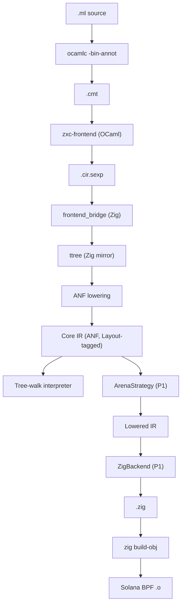

# 01 — Architecture

> **Languages / 语言**: **English** · [简体中文](./zh/01-architecture.md)

## 1. Pipeline

The frontend is borrowed from upstream OCaml; everything from
`Typedtree` onward is ours. See ADR-010 and `10-frontend-bridge.md`.

```text
.ml source
   │
   ▼
[ ocamlc -bin-annot ]                ◀── upstream OCaml, used as a library
   │   .cmt (binary Typedtree)
   ▼
[ zxc-frontend (OCaml glue) ]        ◀── walks Typedtree, enforces subset
   │   .cir.sexp (versioned wire format)
   ▼
[ frontend_bridge (Zig) ]            ◀── parses sexp into Zig mirror types
   │   ttree.Module (Zig)
   ▼
[ ANF lowering ]
   │   Core IR  ◀────────────  THE STABLE CONTRACT
   ├───────────────────────────────► [ Tree-walk interpreter ] (dev only)
   ▼
[ Lowering strategy ]                (P1: arena only)
   │   Lowered IR
   ▼
[ Backend ]                          (P1: Zig codegen)
   │   .zig source
   ▼
[ Zig toolchain ]                    (zig build-lib -target bpfel-freestanding -femit-llvm-bc)
   │   .bc (LLVM bitcode)
   ▼
[ sbpf-linker ]                      (--cpu v3 --export entrypoint)
   │
   ▼
Solana BPF .so
```

The vertical bar between `zxc-frontend` and `frontend_bridge` is the
**only inter-language boundary** in this project. Both sides are
small. Above the bar is OCaml; below it is Zig.

## 2. Layered IR — the central design

```text
.cmt (Typedtree)— produced by upstream OCaml; the canonical
                  type-checked AST. We do not own this format; we
                  consume a *subset* of it (see 10-frontend-bridge.md §4).

.cir.sexp       — our wire format: a versioned, lossless
                  serialisation of the accepted Typedtree subset.
                  Carries `ty` and `span` on every node.

ttree (Zig)     — a 1:1 Zig mirror of the sexp shape. The boundary
                  where OCaml ends and Zig begins. Not optimised,
                  not normalised; pure data.

Core IR (ANF)   — small, regular, typed. Every non-trivial sub-expression
                  is named via `let`. Every call argument is an atom
                  (var or literal). This is the *only* thing the
                  backends and the interpreter consume.

Lowered IR      — Core IR with explicit allocation plans and closure
                  representations. Strategy-specific. In P1 there is
                  only one Lowered IR shape, produced by the Arena
                  strategy.
```

**Invariant:** Core IR is the only stable contract. Backends never
look at `.cmt`, `.cir.sexp`, or `ttree`. Lowered IR is allowed to
differ per strategy — that is the whole point of having it.

Why a sexp wire format and a Zig mirror, instead of consuming
`.cmt` directly from Zig? Because `.cmt` is OCaml's marshal format
and is unstable across releases. The sexp is **ours**, versioned by
us, and decouples upstream OCaml's binary format from our consumer.

## 3. Extension points (designed in, not built)

We isolate three trait-shaped surfaces. Everything else is
implementation detail and may be rewritten freely.

### 3.1 `Layout` (in Core IR)

A small descriptor attached to allocation-bearing nodes (`lam`,
`ctor`, etc.):

```text
Layout {
  region : Region    -- P1: only `Arena` is legal
  repr   : Repr      -- P1: only `Flat | Boxed | TaggedImmediate`
}

Region = Arena
       | Static                      (compile-time data)
       | Stack                       (P1: only for non-escaping locals)
       -- future: Rc, Gc, Region(id)
```

In P1 the inference pass writes `Region::Arena` everywhere (with
`Stack` for obvious non-escaping cases if trivial). The presence of
the field — not the variety of values — is what keeps future regions
cheap to add.

### 3.2 `LoweringStrategy`

Conceptual interface (language-neutral):

```text
LoweringStrategy:
  lower_expr(core_expr)        -> lowered_expr
  plan_alloc(layout)           -> alloc_plan
  closure_repr(lambda)         -> closure_layout
  call_convention(callee_ty)   -> calling_convention
```

P1 has exactly one implementation: `ArenaStrategy`. It assumes a
single arena threaded through every function as an implicit
parameter, allocates closures and ADT payloads in it, and emits
copy-by-value for primitives.

### 3.3 `Backend`

Conceptual interface:

```text
Backend:
  emit_module(lowered_module) -> bytes / source
  target_triple()             -> string
  link(...)                   -> object_or_executable
```

P1 implementations:

- `ZigBackend` — emits `.zig` source, then drives `zig build-obj`
  to produce the BPF `.o`.
- `Interpreter` — executes Core IR directly (does **not** go through
  Lowered IR). Used for `omlz run`, REPL, and as a semantic oracle in
  tests.

Stub-only (signatures present, implementations empty):

- `OCamlBackend` — kept only as a **non-shipping** sanity oracle for
  the stdlib. Not on the main path.
- `LlvmBackend` — placeholder; do not implement until P5+.

## 4. Architectural diagram



## 5. What lives where

| Concern | Owner | Notes |
|---|---|---|
| Lex / parse / type-check / module resolution | upstream OCaml `compiler-libs` | We do not own this code |
| Subset enforcement, Typedtree → sexp | `zxc-frontend` (OCaml glue) | Tiny, read-only consumer of `compiler-libs` |
| Sexp parse → Zig mirror | `frontend_bridge` (Zig) | Pure data, no inference |
| `ttree` → Core IR (ANF + `Layout` fields) | `core/anf.zig` | Our first owned IR transformation |
| Core IR → Lowered IR | `LoweringStrategy` | P1 single impl |
| Lowered IR → bytes | `Backend` | P1: Zig source |
| `.zig` → `.o` | Driver, calls `zig` CLI | Not the compiler's job |
| Runtime helpers (arena, panic, BPF entry shim) | `runtime/zig` | Linked into user programs |
| Diagnostics rendering | `omlz` (Zig), formatted from JSON emitted by `zxc-frontend` | Single user-facing diagnostic style |

## 6. What we explicitly do not do in this architecture

- **No re-typing inside the backend.** Types live on Core IR; backends
  trust them.
- **No multi-pass optimisation in P1.** The Core IR is small enough
  that the Zig backend can rely on `zig`'s optimiser. Constant-fold
  and dead-code-elim only if a test case demands it.
- **No incremental compilation in P1.** Whole-program every time.
- **No package manager.** A program is a single file plus the bundled
  stdlib. Multi-file modules are P3.
