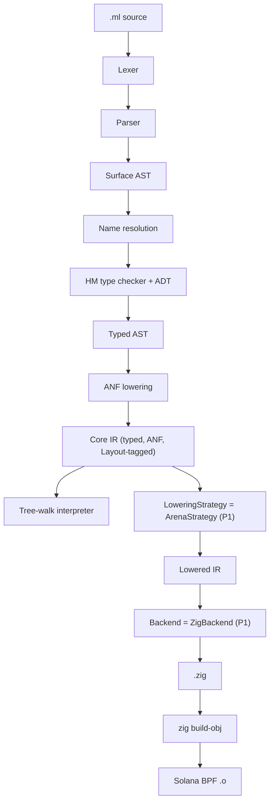

# 01 — Architecture

## 1. Pipeline

```text
.ml source
   │
   ▼
[ Lexer ]
   │   tokens
   ▼
[ Parser ]                    (hand-written recursive descent + Pratt)
   │   Surface AST
   ▼
[ Name resolution ]
   │   resolved AST
   ▼
[ Type checker ]              (Hindley–Milner + ADT)
   │   typed AST
   ▼
[ ANF lowering ]
   │   Core IR  ◀────────────  THE STABLE CONTRACT
   ├───────────────────────────────► [ Tree-walk interpreter ] (dev only)
   ▼
[ Lowering strategy ]         (P1: arena only)
   │   Lowered IR
   ▼
[ Backend ]                   (P1: Zig codegen)
   │   .zig source
   ▼
[ Zig toolchain ]             (zig build-obj -target bpfel-freestanding)
   │
   ▼
Solana BPF .o
```

## 2. Layered IR — the central design

```text
Surface AST     — concrete syntax tree, mirrors OCaml grammar.
                  Lossless w.r.t. spans and trivia for diagnostics.

Typed AST       — same shape as Surface, but every node carries a Ty
                  and every binder is resolved.

Core IR (ANF)   — small, regular, typed. Every non-trivial sub-expression
                  is named via `let`. Every call argument is an atom
                  (var or literal). This is the *only* thing the
                  backends and the interpreter consume.

Lowered IR      — Core IR with explicit allocation plans and closure
                  representations. Strategy-specific. In P1 there is
                  only one Lowered IR shape, produced by the Arena
                  strategy.
```

**Invariant:** Core IR is the only stable contract. Backends never
look at the Surface or Typed AST. Lowered IR is allowed to differ per
strategy — that is the whole point of having it.

## 3. Extension points (designed in, not built)

We isolate three trait-shaped surfaces. Everything else is
implementation detail and may be rewritten freely.

### 3.1 `Layout` (in Core IR)

A small descriptor attached to allocation-bearing nodes (`lam`,
`ctor`, etc.):

```text
Layout {
  region : Region    -- P1: only `Arena` is legal
  repr   : Repr      -- P1: only `Flat | Boxed | TaggedImmediate`
}

Region = Arena
       | Static                      (compile-time data)
       | Stack                       (P1: only for non-escaping locals)
       -- future: Rc, Gc, Region(id)
```

In P1 the inference pass writes `Region::Arena` everywhere (with
`Stack` for obvious non-escaping cases if trivial). The presence of
the field — not the variety of values — is what keeps future regions
cheap to add.

### 3.2 `LoweringStrategy`

Conceptual interface (language-neutral):

```text
LoweringStrategy:
  lower_expr(core_expr)        -> lowered_expr
  plan_alloc(layout)           -> alloc_plan
  closure_repr(lambda)         -> closure_layout
  call_convention(callee_ty)   -> calling_convention
```

P1 has exactly one implementation: `ArenaStrategy`. It assumes a
single arena threaded through every function as an implicit
parameter, allocates closures and ADT payloads in it, and emits
copy-by-value for primitives.

### 3.3 `Backend`

Conceptual interface:

```text
Backend:
  emit_module(lowered_module) -> bytes / source
  target_triple()             -> string
  link(...)                   -> object_or_executable
```

P1 implementations:

- `ZigBackend` — emits `.zig` source, then drives `zig build-obj`
  to produce the BPF `.o`.
- `Interpreter` — executes Core IR directly (does **not** go through
  Lowered IR). Used for `omlz run`, REPL, and as a semantic oracle in
  tests.

Stub-only (signatures present, implementations empty):

- `OCamlBackend` — kept only as a **non-shipping** sanity oracle for
  the stdlib. Not on the main path.
- `LlvmBackend` — placeholder; do not implement until P5+.

## 4. Architectural diagram



## 5. What lives where

| Concern | Owner | Notes |
|---|---|---|
| Tokens, spans, diagnostics | Frontend util | Used by every later phase |
| Surface AST → Typed AST | Frontend | Pure, no IO |
| Typed AST → Core IR | ANF lowering | Inserts `Layout` fields |
| Core IR → Lowered IR | `LoweringStrategy` | P1 single impl |
| Lowered IR → bytes | `Backend` | P1: Zig source |
| `.zig` → `.o` | Driver, calls `zig` CLI | Not the compiler's job |
| Runtime helpers (arena, panic, BPF entry shim) | `runtime/zig` | Linked into user programs |

## 6. What we explicitly do not do in this architecture

- **No re-typing inside the backend.** Types live on Core IR; backends
  trust them.
- **No multi-pass optimisation in P1.** The Core IR is small enough
  that the Zig backend can rely on `zig`'s optimiser. Constant-fold
  and dead-code-elim only if a test case demands it.
- **No incremental compilation in P1.** Whole-program every time.
- **No package manager.** A program is a single file plus the bundled
  stdlib. Multi-file modules are P3.
