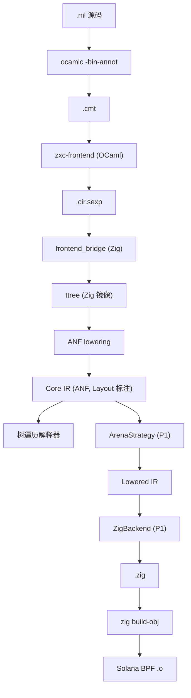

# 01 — 架构

> **Languages / 语言**: [English](../01-architecture.md) · **简体中文**

## 1. 管线

前端从上游 OCaml 借来；从 `Typedtree` 之后所有东西都是我们自己的。
详见 ADR-010 和 `10-frontend-bridge.md`。

```text
.ml 源码
   │
   ▼
[ ocamlc -bin-annot ]                ◀── 上游 OCaml，作为库使用
   │   .cmt（二进制 Typedtree）
   ▼
[ zxc-frontend (OCaml 胶水) ]        ◀── 遍历 Typedtree，强制子集白名单
   │   .cir.sexp（带版本的 wire 格式）
   ▼
[ frontend_bridge (Zig) ]            ◀── 把 sexp 解析成 Zig 镜像类型
   │   ttree.Module（Zig）
   ▼
[ ANF lowering ]
   │   Core IR  ◀────────────  稳定契约
   ├───────────────────────────────► [ 树遍历解释器 ]（仅开发用）
   ▼
[ Lowering 策略 ]                    （P1：仅 arena）
   │   Lowered IR
   ▼
[ 后端 ]                             （P1：Zig 代码生成）
   │   .zig 源码
   ▼
[ Zig 工具链 ]                       （zig build-obj -target bpfel-freestanding）
   │
   ▼
Solana BPF .o
```

`zxc-frontend` 和 `frontend_bridge` 之间那道竖线，是项目里 **唯一的跨语言边界**。
两边都很小。竖线上面是 OCaml，下面是 Zig。

## 2. 分层 IR —— 核心设计

```text
.cmt (Typedtree)— 上游 OCaml 产出；权威的、已类型检查的 AST。
                  我们不拥有这个格式；我们消费它的一个 *子集*
                 （见 10-frontend-bridge.md §4）。

.cir.sexp       — 我们的 wire 格式：
                  对所接受 Typedtree 子集的有版本、无损 S-expression 序列化。
                  每个节点都带 `ty` 和 `span`。

ttree (Zig)     — 上面 sexp 形态的 1:1 Zig 镜像。
                  OCaml 结束、Zig 开始的边界。不优化、不规范化；纯数据。

Core IR (ANF)   — 小、规整、带类型。每个非平凡子表达式都通过 `let` 命名。
                  每个调用参数都是 atom（变量或字面量）。
                  这是后端和解释器 *唯一* 消费的东西。

Lowered IR      — Core IR 加上显式的分配计划和闭包表示。
                  和 strategy 强绑定。
                  P1 只有一种 Lowered IR 形态，由 Arena 策略产出。
```

**不变量：** Core IR 是唯一稳定契约。后端**绝不**回头看 `.cmt`、`.cir.sexp`、
`ttree`。Lowered IR 允许因策略而异 —— 这正是它存在的意义。

为什么要走"sexp wire + Zig 镜像"，而不是直接从 Zig 读 `.cmt`？
因为 `.cmt` 是 OCaml 的 marshal 格式，跨发行版不稳定。
sexp 是 **我们的**，由我们定版本，把上游 OCaml 的二进制格式和我们的消费者解耦。

## 3. 扩展点（设计上留好，**不**在 P1 实现）

我们隔离三个 trait 形状的接口面。其它所有东西都是实现细节，可以自由重写。

### 3.1 `Layout`（在 Core IR 上）

附在所有"会引发分配"的节点（`lam`、`ctor` 等）上的小型描述符：

```text
Layout {
  region : Region    -- P1：唯一合法值是 `Arena`
  repr   : Repr      -- P1：只有 `Flat | Boxed | TaggedImmediate`
}

Region = Arena
       | Static                      （编译期常量）
       | Stack                       （P1：仅在不逃逸的局部上）
       -- 未来：Rc | Gc | Region(id)
```

P1 阶段，推断 pass 在所有地方写 `Region::Arena`（对明显不逃逸的情况，
也可以写 `Stack`）。**字段的存在** —— 而不是 **取值的多样性** —— 才是让未来扩展
低成本的关键。

### 3.2 `LoweringStrategy`

概念接口（与具体语言无关）：

```text
LoweringStrategy:
  lower_expr(core_expr)        -> lowered_expr
  plan_alloc(layout)           -> alloc_plan
  closure_repr(lambda)         -> closure_layout
  call_convention(callee_ty)   -> calling_convention
```

P1 只有一个实现：`ArenaStrategy`。它假设有一个隐式的单 arena，作为每个函数的
首参数贯穿全程；闭包和 ADT payload 在 arena 上分配；原始类型按值拷贝。

### 3.3 `Backend`

概念接口：

```text
Backend:
  emit_module(lowered_module) -> 字节 / 源码
  target_triple()             -> 字符串
  link(...)                   -> object 或 executable
```

P1 实现：

- `ZigBackend` —— 产出 `.zig` 源码，再驱动 `zig build-obj` 产出 BPF `.o`。
- `Interpreter` —— 直接执行 Core IR（**不**走 Lowered IR）。
  用于 `omlz run`、REPL、以及在测试中作为语义参考。

只有 stub 的（签名存在，实现为空）：

- `OCamlBackend` —— 仅作为 stdlib 的**非发布**正确性参考。不在主路径上。
- `LlvmBackend` —— 占位；P5+ 之前不要实现。

## 4. 架构图



## 5. 各阶段归属

| 关注点 | 归属 | 备注 |
|---|---|---|
| Lex / parse / 类型检查 / 模块解析 | 上游 OCaml `compiler-libs` | 我们不拥有这部分代码 |
| 子集白名单、Typedtree → sexp | `zxc-frontend`（OCaml 胶水） | 小、只读，消费 `compiler-libs` |
| sexp 解析 → Zig 镜像 | `frontend_bridge`（Zig） | 纯数据，不做推断 |
| `ttree` → Core IR（ANF + `Layout` 字段） | `core/anf.zig` | 我们拥有的第一道 IR 转换 |
| Core IR → Lowered IR | `LoweringStrategy` | P1 单实现 |
| Lowered IR → 字节 | `Backend` | P1：Zig 源码 |
| `.zig` → `.o` | Driver 调 `zig` CLI | 编译器自身不做这件事 |
| Runtime helper（arena、panic、BPF entry shim） | `runtime/zig` | 链接进用户程序 |
| 诊断渲染 | `omlz`（Zig），按 `zxc-frontend` 输出的 JSON 格式渲染 | 用户面前只有一种诊断风格 |

## 6. 这一架构里我们刻意 **不做** 的事

- **后端不重新做类型检查。** 类型住在 Core IR 上；后端无条件信任它们。
- **P1 不做多 pass 优化。** Core IR 已经够小，Zig 后端可以依靠 `zig` 的优化器。
  常量折叠、死代码删除等只在某个测试用例需要时才考虑。
- **P1 不做增量编译。** 每次都是整程序编译。
- **没有包管理器。** 一个程序 = 一个文件 + 内置 stdlib。多文件模块是 P3 的事。
